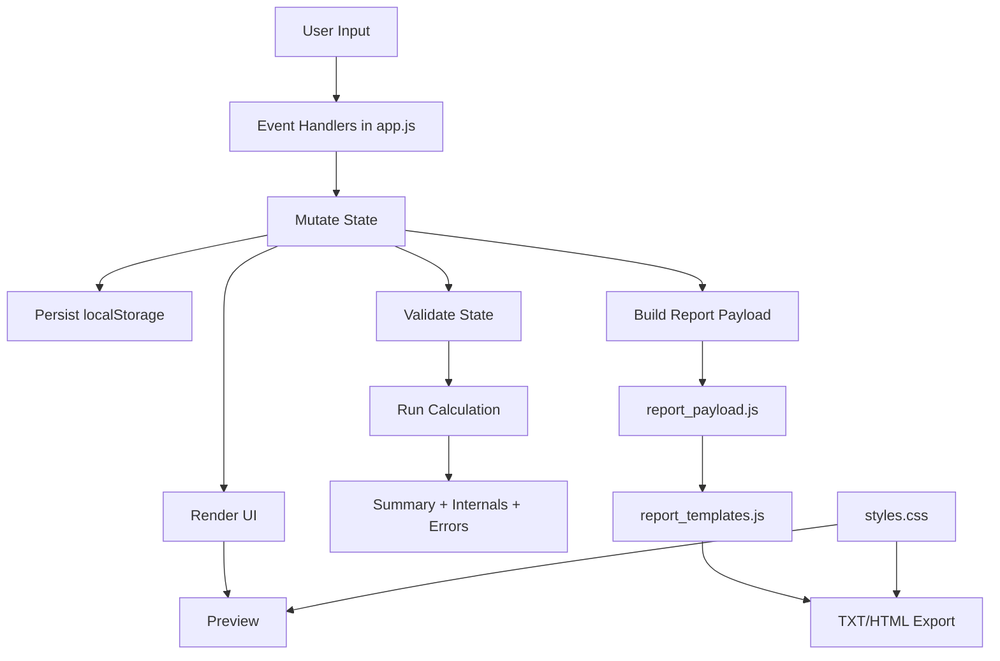

# Data Flow

## Runtime Sequence

1. User changes form fields, slot selections, wildcard controls, rules, or run controls.
2. `app.js` handlers update canonical state and mark temporary draft flags where needed.
3. State is persisted to localStorage and relevant sections are re-rendered.
4. Validation runs in strict or live mode depending on context.
5. Calculator recomputes totals and policy statuses.
6. Report preview refreshes from current calculation result.
7. On export, payload is assembled in `report_payload.js`, then rendered in `report_templates.js`.
8. HTML export embeds CSS text from `styles.css` into the saved document.

## Wildcard Subflow

1. Wildcard row edit begins in numerator/denominator fields.
2. Raw values are stored live and shown as pending while invalid.
3. On blur, values normalize to reduced fraction format when valid.
4. Nudge actions mutate numerator or denominator by exactly 1.
5. Redistribution adjusts unpinned eligible rows to preserve sum=1 where possible.
6. If redistribution fails, the edited row remains changed and pending-invalid until corrected.
