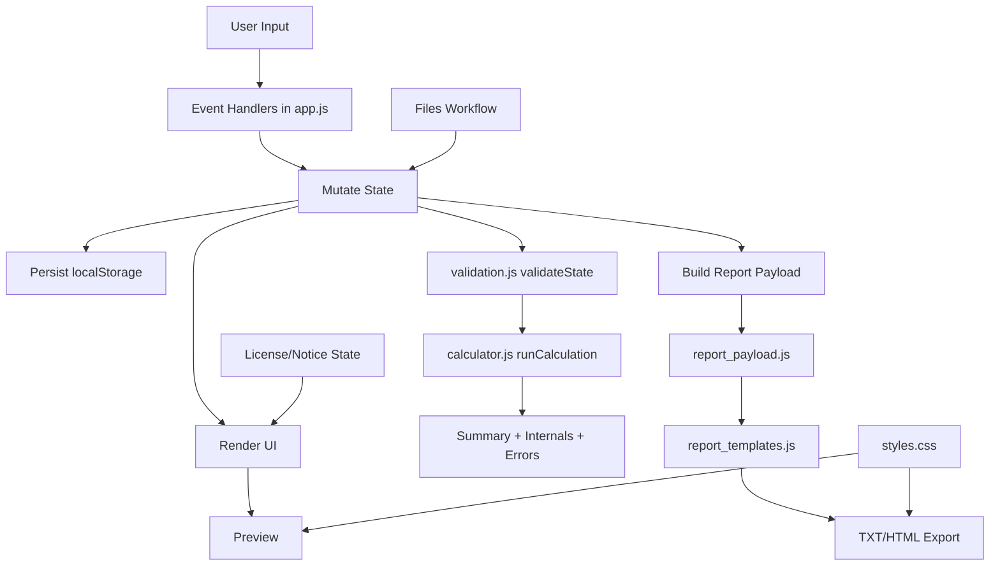

# Data Flow

## Runtime Sequence

1. User changes form fields, slot selections, wildcard controls, rules, or run controls.
2. `app.js` handlers update canonical state and mark temporary draft flags where needed.
3. State is persisted to localStorage and relevant sections are re-rendered.
4. Validation runs in strict or live mode depending on context.
5. Calculator recomputes totals and policy statuses.
6. Report preview refreshes from current calculation result.
7. On export, payload is assembled in `report_payload.js`, then rendered in `report_templates.js`.
8. HTML export embeds CSS text from `styles.css` into the saved document.
9. License overlay gates interaction using `inert` on app content until acknowledgment.
10. Files tab presents guided steps (filename, optional folder pin, config IO, export).

## Wildcard Subflow

1. Wildcard row edit begins in stacked fraction controls (numerator/denominator) and optional LCD nudges.
2. Raw values are stored live and shown as pending while invalid.
3. On blur, valid fraction text is preserved as entered; reduced/canonical form is shown separately.
4. Nudge actions can target fraction num/den or LCD num/den.
5. Redistribution adjusts unpinned eligible rows proportionally to preserve sum=1 where possible.
6. Total-sum validation/rebalance accounts for pinned and unpinned rows.
7. If redistribution fails, the edited row remains changed and pending-invalid until corrected.
